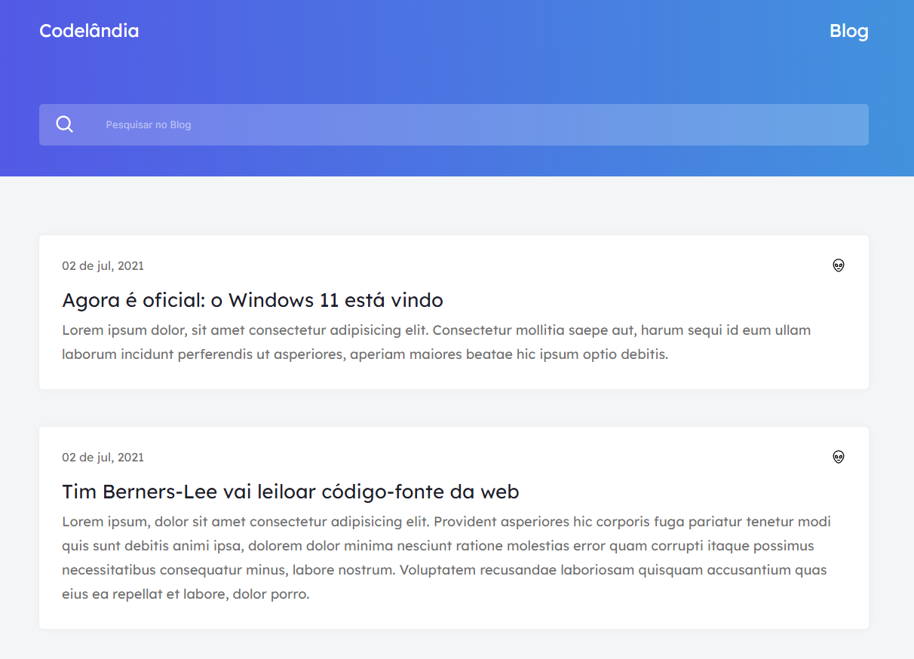

# Desafio #1 [Codelandia](https://discord.gg/wNCWTVuxyz) 💻

#### Uma série de Desafios de programação e linguagem de marcação para Dev's Juniors.

<h4 align="center"><a href=http://desafios-codelandia-kappa.vercel.app/>Clique para visitar o projeto</a></h4>

## 🎯 Objetivo

O desafio consiste em desenvolver um Blog de acordo com o layout disponibilizado no [Figma](https://www.figma.com/file/Yb9IBH56g7T1hdIyZ3BMNO/Desafios---Codelândia?node-id=0%3A1).

## 🛠️ Tecnologias utilizadas

Para o desenvolvimento deste site utilizei as seguintes tecnologias:

- HTML;
- CSS;
